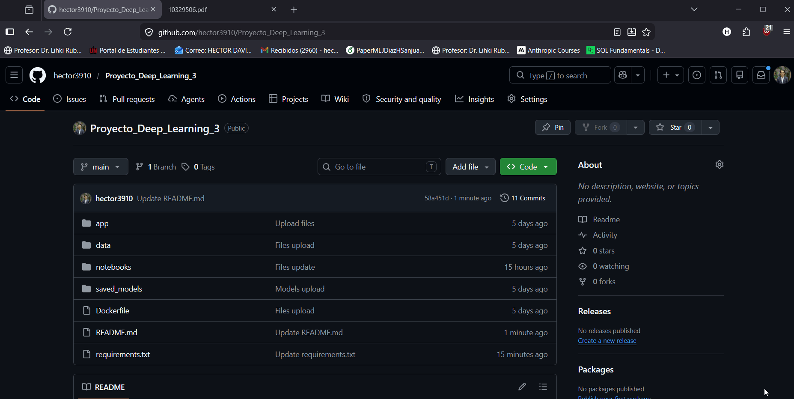

# Proyecto Integrador de Aprendizaje Automático: Segmentación de imágenes biomédicas y Clasificación de texto (NLP) mediante modelos de deep learning: evaluación, comparación y despliegue básico

Este proyecto se divide en **2 bloques**: 

## 1. Segmentación de células

### Descripción

Sistema de segmentación celular basado en múltiples arquitecturas modernas de Deep Learning, aplicado a imágenes de microscopía de campo brillante para evaluar desempeño, generalización y capacidad de detección de instancias celulares.

**Dataset:** [Sartorius Cell Instance Segmentation — Kaggle (2021)] (https://www.kaggle.com/competitions/sartorius-cell-instance-segmentation/overview)
**Imágenes:** 606 imágenes de microscopía
**Clases:** 3 líneas celulares (shsy5y, astro, cort)

--- 

### Modelos implementados

| # | Modelo | Técnica |
|---|--------|---------|
| 1 | U-Net++ | Segmentación semántica multiescala | 
| 2 | HoverNet | Segmentación + separación de núcleos |
| 3 | Cellpose 2.0 | Segmentación basada en gradientes de flujo | 
| 4 | SAM (Segment Anything Model) | Modelo fundacional de segmentación | 
| 5 | Mask R-CNN + Swin Transformer | Detección de instancias + backbone Transformer | 

---

### Métricas de evaluación

- Dice Score  
- Intersection over Union (IoU)  
- Precision  
- Recall  
- AUC  
- Hausdorff Distance  
- Balanced Accuracy


## 2. Clasificación de Currículos con Deep Learning (NLP)
### Descripción

Sistema de clasificación automática de currículos en categorías laborales
usando modelos de Deep Learning y Procesamiento de Lenguaje Natural (NLP).

**Dataset:** [Jarvis Calling Hiring Contest — Kaggle](https://www.kaggle.com/competitions/jarvis-calling-hiring-contest)
**Registros:** 2,484 currículos
**Clases:** 25 categorías laborales (HR, IT, Finance, Healthcare, etc.)

---

### Modelos implementados

| # | Modelo | Técnica | Búsqueda HP |
|---|--------|---------|-------------|
| 1 | RoBERTa | Transformer preentrenado con fine-tuning | Grid Search (4 configs) |
| 2 | Word2Vec + BiLSTM | Embeddings + Red recurrente bidireccional | Random Search (12 iter) |
| 3 | CNN-1D | Convoluciones paralelas multi-kernel | Random Search (10 iter) |
| 4 | TF-IDF + XGBoost | Representación clásica + Gradient Boosting | Grid Search (9 combos) |
| 5 | FastText | Embeddings de n-gramas de caracteres | Random Search (10 iter) |

---

### Métricas de evaluación

- Accuracy
- Precision (weighted)
- Recall (weighted)
- F1-Score (weighted)
- ROC-AUC (weighted OvR)
- Matriz de confusión
- Curva ROC y Precision-Recall

---

### Estructura del proyecto

```
project/
├── data/
│   └── Resume.csv                  # Dataset original de Kaggle
│
├── notebooks/
    ├── Bloque_1/ 
|     ├── 01_EDA_Preprocesamiento.ipynb                  # Análisis Exploratorio de Datos (imágenes)
|     └── 02_Modelos_Entrenamiento.ipynb                 # Entrenamiento y evaluación de modelos (imágenes)
|   ├── Bloque_2/
│     ├── eda.ipynb                                      # Análisis Exploratorio de Datos (NLP)
│     └── modelos_nlp.ipynb                              # Entrenamiento y evaluación de modelos (NLP)
│
├── saved_models/                   # Generado al correr modelos_nlp.ipynb
│   ├── label_encoder.joblib        # Codificador de etiquetas
│   ├── tfidf_best.joblib           # Vectorizador TF-IDF
│   ├── xgboost_best.joblib         # Modelo XGBoost
│   ├── bilstm_best.keras           # Red BiLSTM
│   ├── bilstm_word2idx.pkl         # Vocabulario BiLSTM
│   ├── cnn1d_best.keras            # Red CNN-1D
│   ├── cnn1d_vocab.pkl             # Vocabulario CNN-1D
│   ├── cnn1d_config.json           # Hiperparámetros CNN-1D
│   ├── fasttext_best.keras         # Red FastText
│   ├── fasttext_vocab.pkl          # Vocabulario n-gramas
│   ├── fasttext_config.json        # Hiperparámetros FastText
│   ├── roberta_best.weights.h5     # Pesos RoBERTa (fine-tuned)
│   └── production_bundle.json      # Metadatos del mejor modelo
│
├── app/
│   └── main.py                     # API FastAPI para producción
│
├── Dockerfile                      # Contenedor Docker
├── requirements.txt                # Dependencias del proyecto
└── README.md                       # Este archivo
```

---

### Cómo ejecutar

#### 1. Clonar e instalar dependencias

```bash
pip install -r requirements.txt
```

#### 2. Colocar el dataset

Descargar `Resume.csv` de Kaggle y colocarlo en `data/Resume.csv`.
Luego ajustar la ruta en `notebooks/modelos_nlp.ipynb` sección 2:

```python
DATA_PATH = r'C:/tu/ruta/data/Resume.csv'
```

#### 3. Correr el EDA

Abrir y ejecutar `notebooks/eda.ipynb`

#### 4. Entrenar los modelos

Abrir y ejecutar `notebooks/modelos_nlp.ipynb`
Esto genera automáticamente la carpeta `saved_models/` con todos los artefactos.

#### 5. Levantar la API localmente

```bash
uvicorn app.main:app --reload
```

Abrir en el navegador: [http://localhost:8000/docs](http://localhost:8000/docs)

#### 6. Ejecutar con Docker

```bash
# Construir la imagen
docker build -t resume-classifier .

# Correr el contenedor
docker run -p 8000:8000 resume-classifier
```

---

### Endpoints de la API

| Método | Ruta | Descripción |
|--------|------|-------------|
| GET | `/` | Info general: mejor modelo, F1, clases disponibles |
| POST | `/predict_text` | Clasifica un CV en texto plano |
| GET | `/models/info` | Métricas de todos los modelos entrenados |

#### Ejemplo de uso — `/predict_text`

**Request:**
```json
{
  "text": "Registered Client Service Associate with experience in investment client support, financial advisory assistance, and banking relationship management. Strong background in client account operations, marketing presentations, and book of business management worth $40 million. Previously worked as Relationship Banker II for 8 years, ranked top 10 among 82 reps for 7 consecutive years, exceeding sales quotas and winning Best Sales Representative 3 straight years. Increased branch loan portfolio by $800,000 in 7 months and net deposits by $1.7 million in one quarter. Also has experience as Private Banker and Technical Writer/Web Developer. Holds Series 7 General Securities license. B.S. in Computer Information Systems from Strayer University. Skilled in Microsoft Office, Adobe tools, Oracle 9i, Unix, Visio, and Dreamweaver."
}
```

### Ejemplo curl

```bash
curl -X POST http://localhost:8000/predict_text -H "Content-Type: application/json" -d "{\"text\": \"Registered Client Service Associate with experience in investment client support, financial advisory assistance, and banking relationship management. Strong background in client account operations, marketing presentations, and book of business management worth $40 million. Previously worked as Relationship Banker II for 8 years, ranked top 10 among 82 reps for 7 consecutive years, exceeding sales quotas and winning Best Sales Representative 3 straight years. Increased branch loan portfolio by $800,000 in 7 months and net deposits by $1.7 million in one quarter. Also has experience as Private Banker and Technical Writer/Web Developer. Holds Series 7 General Securities license. B.S. in Computer Information Systems from Strayer University. Skilled in Microsoft Office, Adobe tools, Oracle 9i, Unix, Visio, and Dreamweaver.\"}"
```

**Response:**
```json
{
  "categoria_predicha": "BANKING",
  "confianza": 0.8205,
  "modelo_usado": "RoBERTa"
}
```

---

## Ejemplo de ejecución de la **API**:


<p align="center">
  
</p>

